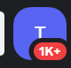
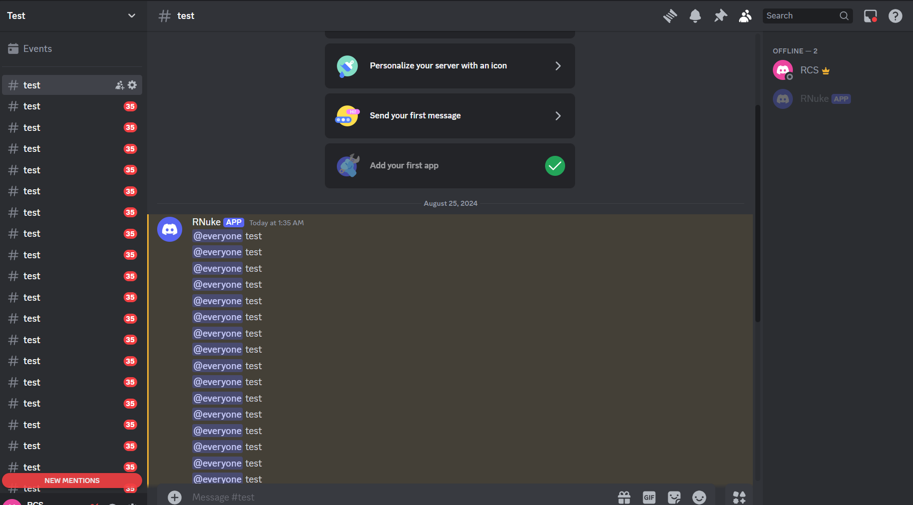

    <h1>RNuke</h1>
    
    
     
     
    

## Feature
- Nuker info
    - Del all Channels
    - Ban all Members (not author)
    - Send 1750 message for a minute
    - Create 50 channel
    - Customize Server and Channel name, message contents
    - Customize Run Command

## Install

### Setup
1. [Download source code zip](https://github.com/RealRCS/RNuke/archive/refs/heads/main.zip)
2. Extract zip
3. Edit `config.json`
4. Run `setup.bat`
5. Run `start.bat`

## How to use
Send Command (It in config.json)

## Run Example

    </img>
     
    </img>

## License

This Bot is licensed under the <a href="https://mit-license.org/">MIT License</a>.
